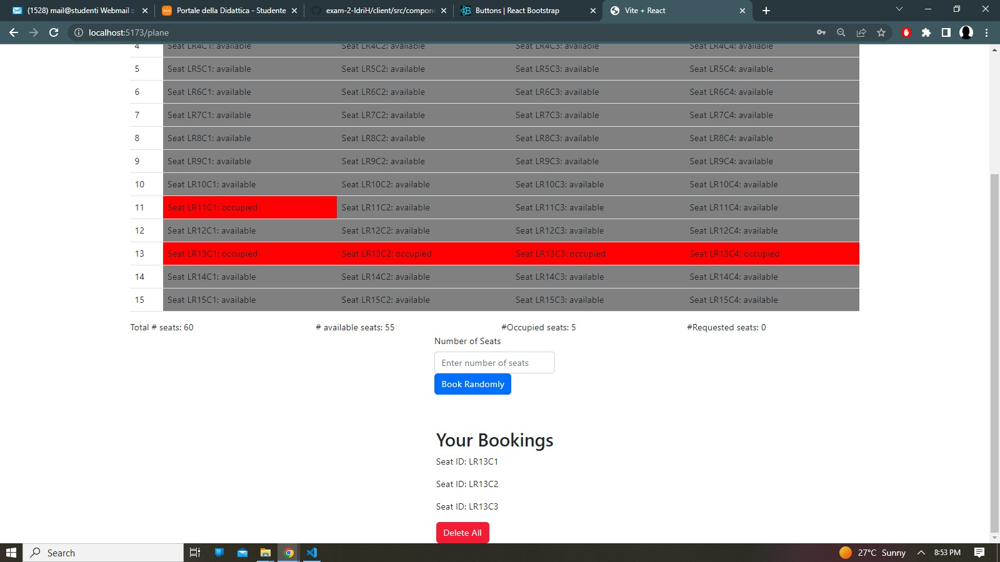

# Exam #2: "AirplaneSeats"

## Student: s319899 Hoxha Idri 

# Server side

## API Server

### Authentication
### login 
- POST `/api/sessions`
  - request parameters and request body content
  - response body content :
    username,password
### retrieve info of the currently logged in user
- GET `/api/sessions/current`
### Logout
DELETE `/api/sessions/current`

### Main functionalities 

- GET `api/seats/:planeid` //retrieve the seats of the specific plane

- PUT `/api/seats/:planeid` // make a booking for a plane
  - request body :  {
    - seats: {
        "seat_id" 
      - }
  - 
  - }
- GET `/api/seats/` // get booking for user

- PUT `/api/seats/user/:planeid` // delete booking for user set the seats back to free note: user is not info about user just part of the name of the api

-PUT `/api/random`
request_body : 
{
    "plane_id": "1",
    "number": "3"
}
- ...

## Database Tables

- Table `users` - contains (user_id,email,salt,hash)
//- Table `airplanes` - contains (plane_id,type) not used
- Table `seats` - contains (seat_id,user_id,plane_id,status)

# Client side

## React Client Application Routes

- Route `/`: home page contains plane selection 
- Route `/plane`: contains the specific plane seats booking forms , and user bookings
- Route `/login`: contains the authentication page
- Route `*` : page not found go back
- 
- ...

## Main React Components

- `MainLayout` (in `App.jsx`): component that contains the navbar
- `Plane` (in `Plane.jsx`): The parent component of many childs but main functionality displaing and managing the seats
- `UserBooking` : component that contains and shows the bookings of the logged in user in the specific plane 
- `RandomBooking , Booking` :components used to make bookings

(only _main_ components, minor ones may be skipped)

# Usage info

## Example Screenshot

## Users Credentials

- username: user1@example.com password : password
- username: user2@example.com password : password
- username: user3@example.com password : password
- username: user4@example.com password : password
